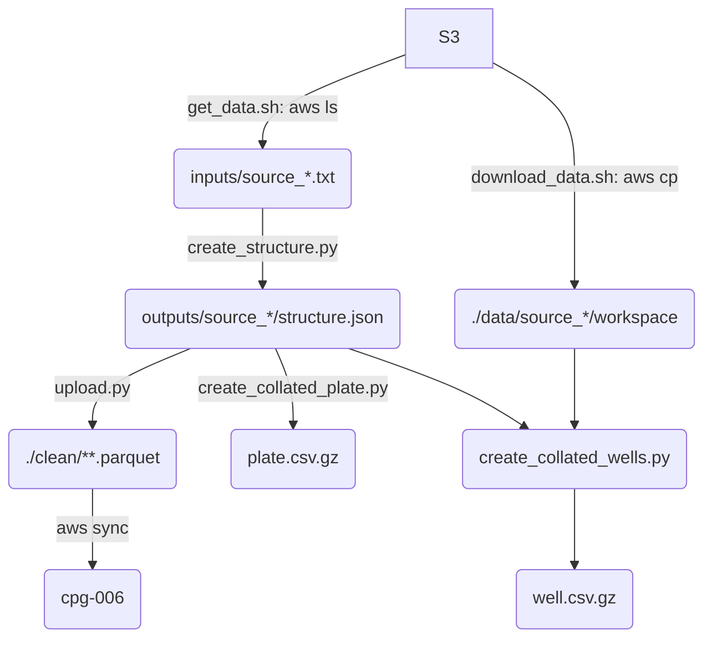

# Workflow

How the scripts and data are collected. WIP

```mermaid
graph TD
    A[S3] -->|get_data.sh: aws ls| B(inputs/source_*.txt)
    B -->|create_structure.py| C(outputs/source_*/structure.json)
    C -->|upload.py| D(./clean/**.parquet)
    D -->|aws sync| G(cpg-006)
    C -->|create_collated_plate.py| E(plate.csv.gz)
    C --> F(create_collated_wells.py)

    A --> |download_data.sh: aws cp| H(./data/source_*/workspace)
    H --> F

    F --> I(well.csv.gz)
```
